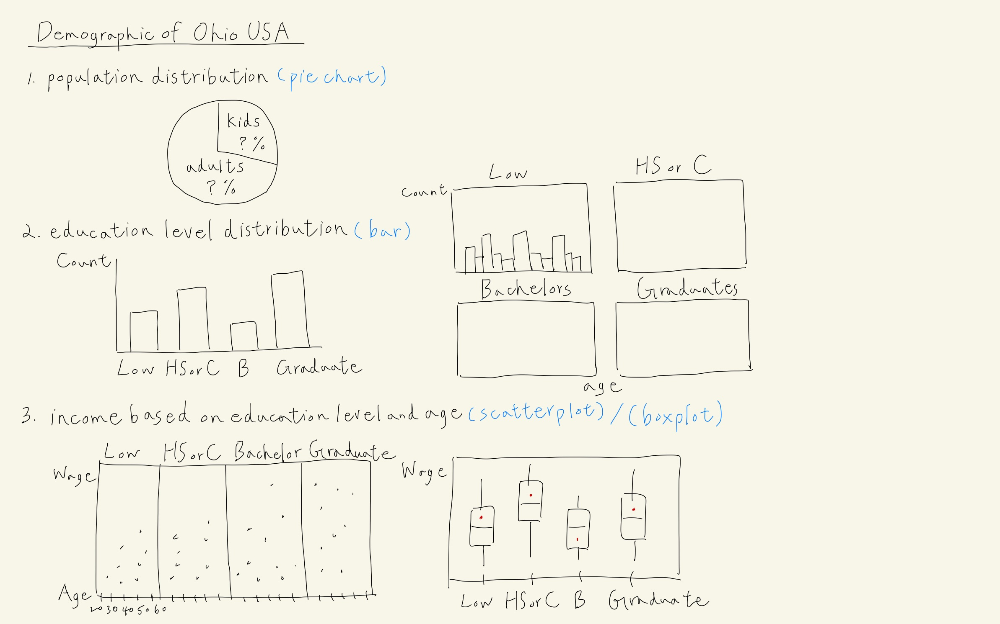

```{r setup, include=FALSE}
knitr::opts_chunk$set(echo = FALSE)
```

# 1. Overview
In this take-home exercise, we will explore and reveal the demographics of Ohio in USA by creating data visualizations with `ggplot2` in R. The data is provided and can be downloaded from [VAST Challenge 2022](https://vast-challenge.github.io/2022/). The data visualizations included in this exercise are:

+ A population proportion of kids and adults.
+ Numbers of education levels in 4 categories: Low, High School or College, Bachelors and Graduate.
+ Numbers of education levels on different age.
+ A medium of wage on education levels.
+ A distribution of wage on age by education levels.


# 2. Data Preparation
### 2.1 Challenges Faced
+ The raw data only reveals a boolean value that whether the surveyed volunteers have kids or not without further detailed information such as their kids' age for us to identify the population composition.
+ The data of participants' income contains different timestamp record and is also inconsistent between each participants. 
+ The default visualization of size order created by `ggplot2` is based on the alphabetical order of categories in the column.

### 2.2 Ways to Overcome Challenges
+ The legal age of an adult is 18 years old generally in US; therefore, the definition of a kid is a person who is under 18. According to [Forbes study](https://www.forbes.com/sites/ashleystahl/2020/05/01/new-study-millennial-women-are-delaying-having-children-due-to-their-careers/?sh=5716a96a276a), the average of first-time mother in USA is from 21 to 26, while for fathers, it is from 27 to 31. Given this, we can defer that their kids are already an adult for those participants aged over 50.
+ The function of *summarize()* in `dplyr` package can help us summarize each group to fewer rows. Thus, we can derive the average income of each participants from different timestamp.
+ The *relevel()* function in R can help us to resort the levels of a factor by sepcifying our expected order on the grouping variables.

# 3. Sketch


# 4. Step-by-step Description
### 4.1 Installing Packages
A list of packages, namely `tidyverse`, `plotly`, `readxl`, `knitr`, `dplyr`, `ggplot2`, `grid` would be used in this exercise. This code chunk installs the required packages and loads them into RStudio environment.

```{r echo=TRUE}
packages = c('tidyverse', 'plotly', 'readxl', 'knitr', 'dplyr', 'ggplot2', 
             'grid')

for(p in packages){
  if(!require(p, character.only = T)){
    install.packages(p)
  }
  library(p, character.only = T)
}
```

### 4.2 Importing the Dataset
Data import was accomplished using read_csv() of readxl package, which is useful for reading csv files into a tibble.

```{r echo=TRUE}
participants <- read_csv("Datasets/Attributes/Participants.csv")
FinancialJournal <- read_csv("Datasets/Journals/FinancialJournal.csv")

# Inspecting the structure of every columns in the dataframe
glimpse(participants)
glimpse(FinancialJournal)
```

### 4.3 Data Wrangling
**DERIVING NUMBERS OF KIDS AND ADULTS**

To derive new columns from the existing columns, the *mutate()* of `dplyr` is used to generate the data with condition function, *if_els()*.

```{r echo=TRUE, eval=FALSE}
participants_mutated <- participants %>%
  mutate(kids = if_else(haveKids == TRUE & age < 50, householdSize - 2, 0)) %>%
  mutate(adults = if_else(haveKids == TRUE & age < 50, 0, householdSize))
```

**MERGING THE TWO DATA FRAMES**

Before combining the separate data frames, the join table is created first and has calculated the average wage of each participants by participant ID. The *merge()* of **dplyr** is used to add a new column, wage, on the original data frame.

```{r echo=TRUE, eval=FALSE}
Wage <- FinancialJournal %>%
  filter(category == "Wage") %>%
  group_by(participantId) %>%
  select(participantId, amount) %>%
  summarise(wage = mean(amount))

participants_mutated <- merge(x = participants_mutated, 
                              y = Wage[ , c("participantId", "wage")], 
                              by = "participantId", all.x = TRUE)
```


```{r eval=FALSE}
# Join Expenditure
Expenditure <- FinancialJournal %>%
  filter(category != "Wage") %>%
  group_by(participantId, category) %>%
  select(participantId, amount) %>%
  summarise(amount = mean(amount))

TotalExpense <- Expenditure %>%
  group_by(participantId) %>%
  select(participantId, amount) %>%
  summarise(expenditure = sum(amount))

participants_mutated <- merge(x = participants_mutated, 
                              y = TotalExpense[ , c("participantId", "expenditure")],
                              by = "participantId", all.x = TRUE)
```


### 4.4 Plot Population Proportion
**PIVOTTING DATA**

The column of kids and adults in original data frame are two separate columns and shows the value of each. This is not a good data structure for `ggplot2` to produce the graph, so we use *gather()* function to pivot them into a better structure.

```{r echo=TRUE, eval=FALSE}
Population <- participants_mutated %>%
  select(kids, adults) %>%
  summarise(kids = sum(kids), adults = sum(adults)) 

Population <- gather(Population, kids, adults, key = group, value = value)
```

```{r eval=FALSE}
saveRDS(participants_mutated, file = "participants_mutated.rds")
saveRDS(Population, file = "Population.rds")
```

```{r}
participants_mutated <- readRDS(file = "participants_mutated.rds")
Population <- readRDS(file = "Population.rds")
```

**PLOTTING THE GRAPH**

To look at the demographics of a city, the population composition is the first thing that we would like to know and the pie chart is the suitable one to plot, which is mainly used for displaying the proportion in a variable. 

A graph was plotted using `ggplot2` as follows:

+ *geom_label* is used to show the value of each group.
+ *geom_text* is used to display and calculate the percentage of each group.

```{r echo=TRUE}
ggplot(Population, aes(x="", y=value, fill=group)) +
  geom_bar(stat="identity", width=1, color="white") +
  coord_polar("y", start=0) +
  theme_void() +
  geom_label(aes(label = value), 
             position = position_stack(vjust = 0.5), 
             show.legend = FALSE) +
  geom_text(aes(label = paste(round(value / sum(value) * 100, 1), "%"), x = 1.3), 
            position = position_stack(vjust = 0.5)) +
  scale_fill_brewer() +
  ggtitle("Population Composition in Ohio USA") +
  theme(plot.title = element_text(hjust = 0.5))
```

### 4.5 Plot Education Level
After having a quick look at the population, another important factor in demographics is people's education level. The bar graph is to show the difference and the number of people in each category in a descending order.

A graph was plotted using `ggplot2` as follows:

+ *reorder()* is to sort the bars by their respective frequencies for better comparison.
+ *geom_text()* is to show the information of their value and percentage.

```{r echo=TRUE}
ggplot(participants_mutated, aes(x=reorder(educationLevel, 
                                           educationLevel, 
                                           function(x)-length(x)))) +
  geom_bar(fill = "lightsteelblue1") +
  ylim(0, 580) +
  geom_text(stat="count", 
      aes(label=paste0(..count.., ", ", 
      round(..count../sum(..count..)*100, 1), "%")), vjust=-1) +
  ylab("No. of\nParticipants") +
  theme(axis.title.y=element_text(angle = 0)) +
  ggtitle("Population Distribution on Education Level") +
  theme(plot.title = element_text(hjust = 0.5)) +
  theme(axis.title.x=element_blank())
```

### 4.6 Plot Education Level on Different Age
We would like to see further that the distribution of people in different age in each education level, we also put the background data that sums up the number of people in different age. 

A graph was plotted using `ggplot2` as follows:

+ *factor()* of Base R function can help resort the levels of a factor by our expected order.
+ Creating the *data_bg* is to reveal the distribution of age by education level with reference to all participants.
+ *facet_wrap()* is created to display numbers of people by a discrete variable, education level,  on different age.

```{r echo=TRUE}
participants_mutated$educationLevel = 
  factor(participants_mutated$educationLevel,
         levels=c('Low','HighSchoolOrCollege','Bachelors','Graduate'))

data <- participants_mutated
data_bg <- data[, -5]

ggplot(data, aes(x = age, fill = educationLevel)) +
  geom_histogram(data = data_bg, fill = "grey", alpha = .5) + 
  geom_histogram(colour = "white") +
  facet_wrap(.~ educationLevel) +
  guides(fill = FALSE) +  
  theme_bw() +
  theme(strip.background = element_rect(fill="beige")) +
  xlab("Age") +
  theme(axis.title.x = element_text(angle = 0)) +
  theme(axis.title.y = element_blank()) +
  ggtitle("Numbers of People in Different Age in Each Education Level") +
  theme(plot.title = element_text(hjust = 0.5))
```

### 4.7 Plot the Medium of Income by Eduction Level
The boxplot is a way to compare multiple data distributions, since they can be placed side by side by a discrete variable. Here we would like use box plot to see the financial conditions of each participants by education level.

A graph was plotted using `ggplot2` as follows:

+ The medium value is added by using the *geom_()* function with *stat=summary* and respective function in *fun.y*.

```{r echo=TRUE} 
ggplot(data, aes(x = educationLevel, y = wage)) +
  geom_boxplot() +
  geom_point(stat="summary",
             fun.y="medium",
             colour ="red",
             size = 1.5) +
  ylab("Wage\n(USD)") +
  theme(axis.title.y=element_text(angle = 0)) +
  theme(axis.title.x=element_blank())  +
  ggtitle("The Medium of Income by Education Level") +
  theme(plot.title = element_text(hjust = 0.5))
```

### 4.8 Plot the Income on Age by Eduction Level
Since the age is also a factor to affect one's income, we use the scatterplot to present, helping us easily observe the value of each point in two axes.

A graph was plotted using `ggplot2` as follows:

+ *facet_grid()* instead of *facet_wrap()* is to better compare the value from discrete variables on the matrix of panels in one row.

```{r echo=TRUE} 
ggplot(participants_mutated,
       aes(x = age, y = wage, colour = factor(educationLevel))) +
  geom_point(size = 1) + 
  facet_grid(.~ educationLevel, scales = "free") +
  theme(strip.background = element_rect(fill="beige"))  +
  guides(colour = FALSE) +
  xlab("Age") +
  theme(axis.title.x = element_text(angle = 0)) +
  ylab("Wage\n(USD)") +
  theme(axis.title.y=element_text(angle = 0)) +
  ggtitle("Numbers of People in Different Age in Each Education Level") +
  theme(plot.title = element_text(hjust = 0.5))
```

### 4.9 Insight from Visualization
From the plot, we can describe that the education level in Ohio is high. Almost 40% of people graduated from bachelor and even higher and over 50% of people go to work after studying in high school and college. In general, higher education level would result in higher income. The boxplot above has verified this and delivers the same information. The value of medium becomes higher from high school or college to graduate. Although the medium of low education level is higher than others, the percentage is too small (less than 10%) and the spread of wage is large. We would not say people would have higher income if only in low education level. However, the scatterplot tells us that the income for the majority of people are under 250 dollars no matter the education level. Therefore, we can obtain that those whose income are over 250 dollars in Ohio belongs to higher class.

# 5. Learning Points
This take-home exercise provides a great opportunity to get familiarized with how to clean data and make the visualization by R packages, especially using `tidyverse` and `ggplot2` and their extensions. 

My key takeaways are:

+ Always plan first before writing the code. A good visualization does not just plot a graph and mark the label there but also the information behind. This is a kind of storytelling for the audience to understand what you would like to deliver from the graph. To convince others of our findings, a logical plan is necessary!
+ Remember the principle of 'Garbage in, garbage out.' This means that a data preparation for needed variables must be done properly before clear and meaningful visualizations are built no matter using R, Python or Tableau.


