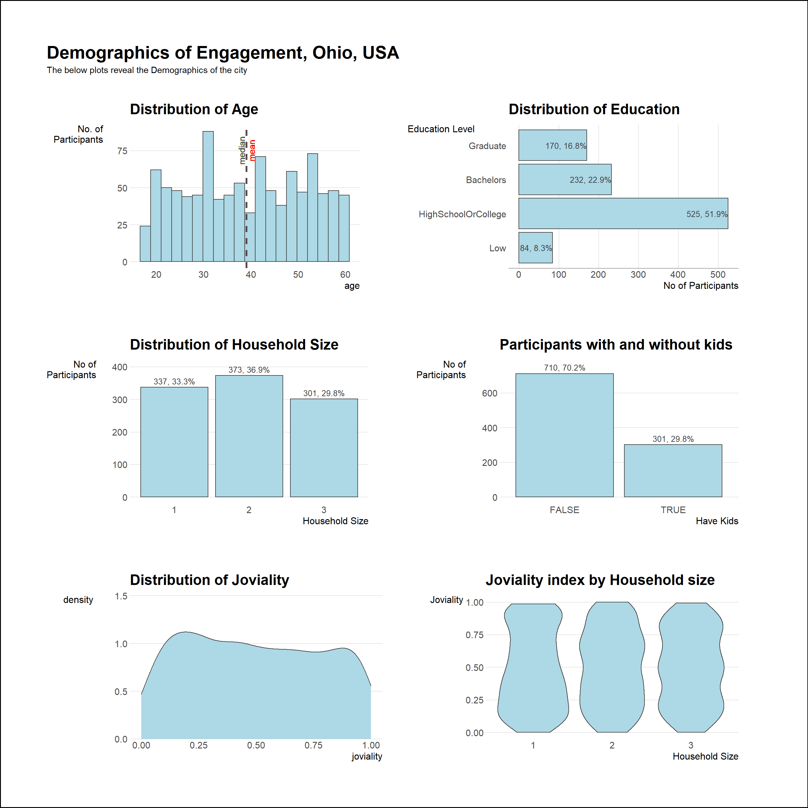

```{r setup, include=FALSE}
knitr::opts_chunk$set(echo = FALSE)
```


# 1. Overview
In this exercise, we will critique the following distribution from a peer in terms of graph's clarity and aesthetics, and will remake the original design based on the data visualization principles and best practice.




# 2. Critique
### 2.1 Clarity
+ **Chart Title is not helpful; absence of lead-in and call-outs**

The title of above 6 plots does not explain the context of the visualization. Readers would not know the key message that the graph would like to convey. For example, the title "Distribution of Age" on first graph, it does not point out what does the number of distribution on age present for. Moreover, there are also no lead-in and call-outs to explain any trend or insights.

+ **Arrangement of categorical variables** 

  + On graph 2, the arrangement of education level is not readable for users in jumbled order.

  + On graph 4, the x-axis is arranged based on numbers of participants in descending order. However, it is not intuitive for readers with the false group appearing on the left, followed by the true group. This is quite confusing for readers who expect a logical order of x-axis.

+ **Chart Type in Appropriate**

  + Density plots are useful to quickly visualize the distribution of imbalanced dataset by smoothing out the noise and displaying the peak and good to compare the distribution of two datasets. For graph 5, the distribution is quite flat, which would be hard to detect highest density at first glance.

  + violin plots are used for comparing multiple data distribution since they are placed side by side. However, the statistical distribution of each category such as mean and medium cannot be observed from it. For instance, readers can only witness that there is less number from house size 1 with 0.75 joviality among three but cannot know the position of statistical values.
  
### 2.2 Aesthetics
+ **Tick marks are necessary on continuous scale**

Tick marks are missing for continuous data on graph 1 and 5. They are used to indicate a reference value at a given point in a chart and ensure the number of tick marks between each labeled tick marks is same.

+ **Lack of data-ink and annotations**

The above 6 charts are all used the same color without data-ink or any annotations, which is difficult for readers to identify the message intending to deliver from each graph.

+ **X-axis and Y-axis Title**

The title of x-axis and y-axis should be consistent with a start of uppercase letters or lowercase letters.

# 3. Data Preparation
The data preparation step here is to load the data and visualization from the original author, which is not the main focus on the exercise, so I would not go into details for this and just for reference.

**Installing Packages**
```{r}
packages <- c('tidyverse','ggdist','gghalves','ggthemes','hrbrthemes','ggridges','patchwork','wesanderson')
for(p in packages){
  if(!require(p, character.only = T)){
    install.packages(p)
  }
  library(p, character.only = T)
}
```

**Importing Data**
```{r eval=FALSE}
participants_data <- read_csv("Datasets/Attributes/Participants.csv")
```

```{r eval=FALSE}
saveRDS(participants_data, file = "participants_data.rds")
```

```{r}
participants_data <- readRDS(file = "participants_data.rds")
```

# 4. Redesigned Visualization
### 4.1 Step-by-Step Description
**Graph 1 - Original**
```{r}
before1 <- ggplot(data=participants_data,
       aes(x = age)) +
  geom_histogram(bins=20,
                 color = "grey25",
                 fill = "light blue")+
  ggtitle("Distribution of Age")+
  ylab("No. of\nParticipants") +
  theme_ipsum(axis_title_size = 12,
              grid ="Y") +
  theme(axis.title.y = element_text(angle=0))+
  geom_vline(aes(xintercept=mean(age,na.rm=T)),
              color="red",
              linetype="dashed",
              size=1) +
  geom_vline(aes(xintercept=median(age,na.rm=T)),
              color="grey30",
              linetype="dashed",
              size=1)+
  geom_text((aes(x= mean(age,na.rm=T)+1,
                 label="mean",
                 y = 75,
                 angle =90)),
            color= "red")+
  geom_text((aes(x= median(age,na.rm=T)-1,
                 label="median",
                 y = 75,
                 angle =90)),
            color = "grey30")
print(before1)
```

**Graph 1 - Remake**
```{r}
after1 <- ggplot(data=participants_data,
       aes(x = age)) +
  geom_histogram(bins=20,
                 color = "grey20",
                 fill = "lightblue3", size=0.4)+
  ggtitle(label= "Distribution of Participants' Age",
          subtitle= "The proportion of 30 to 40 age groups account for the most in Ohio's population")+
  xlab("Age")+
  ylab("Number of\nParticipants") +
  theme(axis.title.y = element_text(angle=0))+
  geom_vline(aes(xintercept=mean(age,na.rm=T)),
              color="red",
              linetype="dashed",
              size=.6) +
  geom_vline(aes(xintercept=median(age,na.rm=T)),
              color="darkblue",
              linetype="dashed",
              size=.6)+
  geom_text((aes(x= mean(age,na.rm=T)+1,
                 label="mean",
                 y = 75,
                 angle =90)),
            color= "red")+
  geom_text((aes(x= median(age,na.rm=T)-1,
                 label="median",
                 y = 75,
                 angle =90)),
            color = "darkblue")+
  scale_x_continuous(breaks=seq(20,60,5))+
  scale_y_continuous(breaks=seq(0,85,20))+
  theme(axis.title.y= element_text(angle=0),
        plot.title = element_text(color="black", size=16, face="bold.italic"),
        plot.subtitle = element_text(size=10),
        panel.background= element_blank(), 
        axis.line= element_line(color= 'grey'), 
        panel.grid.major.y = element_line(size = 0.3, 
                                          linetype = 'solid', colour = "grey"), 
        panel.grid.minor.y = element_line(size = 0.1, 
                                          linetype = 'solid', colour = "grey")) 

print(after1)  
```

Improvements are made on a few elements:

+ Minor grid line is added on the y-axis, which helps reader know the exact value for each bar and compare for different groups.

+ Subtitle is updated to indicate the insight from graph and help reader understand the message behind.

+ Tick marks is added on x-axis and y-axis. This is necessary for continuous variables to point out the corresponding values to each bar.


**Graph 2 - Original**
```{r}
level_order <- c('Low','HighSchoolOrCollege','Bachelors','Graduate')
before2 <- ggplot(data=participants_data,
      aes(x=factor(educationLevel,levels = level_order)))+
  geom_bar(color = "grey25",
           fill="light blue") +
  coord_flip() +
  ylab("No of Participants") +
  xlab("Education Level") +
  theme_ipsum(axis_title_size = 12, grid ="X")+
  theme(axis.title.y=element_text(angle =0,
                                  margin=margin(r=-70)),
        axis.line.x = element_line(color="grey25", size = 0.02)) +
  geom_text(stat="count",
    aes(label=paste0(..count..,", ",
    round(..count../sum(..count..)*100,
      1),"%")),
    hjust=1,
    color = "grey25",
    size=3.5)+
  ggtitle("Distribution of Education")

print(before2)
```

**Graph 2 - Remake**
```{r}
after2 <- ggplot(data=participants_data,
      aes(x=reorder(educationLevel,educationLevel,function(x)length(x))))+
  geom_bar(fill="light blue3") +
  coord_flip() +
  ylab("Number of Participants") +
  xlab("Education Level") +
  theme(axis.title.y=element_text(angle =0,
                                  margin=margin(r=-70)),
        panel.grid.major.y = element_blank(),
        panel.grid.minor.y = element_blank(),
        panel.grid.minor.x = element_blank()) +
  geom_text(stat="count",
    aes(label=paste0(..count..,", ",
    round(..count../sum(..count..)*100,
      1),"%")),
    hjust=1.08,
    color = "grey30") +
  theme(axis.title.y= element_text(angle=0),
        plot.title = element_text(color="black", size=16, face="bold.italic"),
        plot.subtitle = element_text(size=10),
        panel.background= element_blank(), 
        axis.line= element_line(color= 'grey'), 
        panel.grid.major.x = element_line(size = 0.3, 
                                          linetype = 'solid', colour = "grey"), 
        panel.grid.minor.x = element_line(size = 0.1, 
                                          linetype = 'solid', colour = "grey"),
        axis.ticks.y = element_blank()) +
  ggtitle(label= "Distribution of Participants' Education Level",
          subtitle= "Most people in Ohio enter the workplace after graduating from high school or college")

print(after2)

```

Improvements are made on a few elements:

+ The order of education level on y-axis is reorder in descending order. This format is more clear and readable to find out the lowest and highest value on graph.

+ The label on bars has been adjusted and moved a little to left so that the icon of % won't cling to the border of bars.

**Graph 3 - Original**
```{r}
before3 <- ggplot(data=participants_data,
      aes(x=householdSize))+
  geom_bar(color = "grey25",
           fill="light blue") +
  ylab("No of\nParticipants") +
  xlab("Household Size") +
  ylim(0,400) +
  theme_ipsum(axis_title_size = 12, grid ="Y")+
  theme(axis.title.y=element_text(angle =0,
                                  margin=margin(r=20))) +
  geom_text(stat="count",
    aes(label=paste0(..count..,", ",
    round(..count../sum(..count..)*100,
      1),"%")),
    vjust=-0.5,
    color = "grey25",
    size=3.5)+
  ggtitle("Distribution of Household Size")

print(before3)
```

**Graph 3 - Remake**
```{r}
after3 <- ggplot(data=participants_data,
      aes(x=householdSize))+
  geom_bar(fill="light blue3") +
  ylab("Number of\nParticipants") +
  xlab("Household Size") +
  ylim(0,400)+
  ggtitle(label= "Distribution of Participants' Household Size",
          subtitle= "Around 70% of participants are married, but most of them do not have kids in familiy") +
  theme(axis.title.y= element_text(angle=0,
                                  margin=margin(r=20)),
        panel.background= element_blank(),
        plot.title = element_text(color="black", size=16, face="bold.italic"),
        plot.subtitle = element_text(size=10), 
        axis.line= element_line(color= 'grey'), 
        panel.grid.major.y = element_line(size = 0.3, 
                                          linetype = 'solid', colour = "grey"), 
        panel.grid.minor.y = element_line(size = 0.1, 
                                          linetype = 'solid', colour = "grey"),
        axis.ticks.x = element_blank())+
  geom_text(stat="count",
    aes(label=paste0(..count..,", ",
    round(..count../sum(..count..)*100,
      1),"%")),
    vjust=-0.5,
    color = "grey25",
    size=3.5)

print(after3)
```

Improvements are made on a few elements:

+ Without the border line on bars, the overall layout and design is more neat and concise.

+ Adding minor grid line can accurately know the value on each bar without labels on it.

+ The title is renamed to be more specific.

**Graph 4 - Original**
```{r}
before4 <- ggplot(data=participants_data,
      aes(x=haveKids))+
  geom_bar(color = "grey25",
           fill="light blue") +
  ylab("No of\nParticipants") +
  xlab("Have Kids") +
  ylim(0,750) +
  theme_ipsum(axis_title_size = 12, grid ="Y")+
  theme(axis.title.y=element_text(angle =0,
                                  margin=margin(r=20))) +
  geom_text(stat="count",
    aes(label=paste0(..count..,", ",
    round(..count../sum(..count..)*100,
      1),"%")),
    vjust=-0.5,
    color = "grey25",
    size=3.5)+
  ggtitle("Participants with and without kids")
print(before4)
```

**Graph 4 - Remake**
```{r}
participants_data <- within(participants_data, 
                   haveKids <- factor(haveKids, 
                                      levels=names(sort(table(haveKids), 
                                                        decreasing=FALSE))))

after4 <- ggplot(data=participants_data, aes(x=haveKids))+
  geom_bar(fill="light blue3", width = 0.7) +
  ylab("Number of\nParticipants") +
  xlab("Have Kids") +
  theme(axis.title.y=element_text(angle =0,
                                  margin=margin(r=20))) +
  geom_text(stat="count",
    aes(label=paste0(..count..,", ",
    round(..count../sum(..count..)*100,
      1),"%")),
    color = "grey25",
    hjust=0.5,
    vjust=-0.3)+
  ggtitle(label = "Dsitribution of Participants with and without kids",
          subtitle = "Most family do not have kids in Ohio, even though the majority are married")+
  scale_y_continuous(breaks=seq(0,1200,150))+
  theme(axis.title.y= element_text(angle=0),
        plot.title = element_text(color="black", size=16, face="bold.italic"),
        plot.subtitle = element_text(size=10),
        panel.background= element_blank(), 
        axis.line= element_line(color= 'grey'), 
        panel.grid.major.y = element_line(size = 0.3, 
                                          linetype = 'solid', colour = "grey"), 
        panel.grid.minor.y = element_line(size = 0.1, 
                                          linetype = 'solid', colour = "grey"),
        axis.ticks.x = element_blank()) 
print(after4)
```

Improvements are made on a few elements:

+ Adjusting the order of x-axis in logical way. 

+ Removing the border line on bars for clear visualization.

**Graph 5 - Original**
```{r}
before5 <- ggplot(participants_data,
       aes(x=joviality))+
  geom_density(color = "grey25",
               fill="light Blue")+
  ggtitle("Distribution of Joviality")+
  theme_ipsum(axis_title_size = 12, grid="Y")+
  theme(axis.title.y = element_text(angle=0))+
  scale_y_continuous(expand = c(0,0),limits = c(0,1.5))

print(before5)
```

**Graph 5 - Remake**
```{r}
after5 <- ggplot(participants_data, 
       aes(joviality)) +
  geom_histogram(bins=20,
                 color = "grey20",
                 fill = "white", size=0.4) +
  geom_density(aes(y= ..density..*60), lwd = 1, colour ="lightblue3",
               fill = "lightblue3", alpha = 0.6) +
  scale_y_continuous('Number of\nResidents',
                     expand = c(0.05, 0.2),
                     sec.axis = sec_axis(~. /60, name= 'Density',
                                         breaks= seq(0, 1.2, 0.5) )) +
  geom_vline(aes(xintercept=mean(joviality)),
            color="red", linetype="dashed", size=.6)+
  geom_vline(aes(xintercept=median(joviality)),
            color="darkblue", linetype="dashed", size=.6) +
  labs(y= 'Number of\nResidents', x= 'Joviality') +
  ggtitle(label= "Distribution of Residents' Joviality",
       subtitle= 'Numbers of residents in Ohio with happiness or not distribute evenly') +
  theme(axis.title.y= element_text(angle=0), 
        axis.title.y.right = element_text(angle=0, vjust = 1),
        panel.grid.major = element_line(color= 'grey', size = 0.1),
        panel.background= element_blank(), 
        axis.line= element_line(color= 'grey'),
        plot.title = element_text(color="black", size=16, face="bold.italic"),
        plot.subtitle = element_text(size=10))

print(after5)
```

Improvements are made on a few elements:

+ Histogram is added on the visualization because it is difficult for reader to identify the value for different level of joviality. From the density graph we can conclude that there are two local peaks on the distribution, one around joviality = 0.15-0.30 and another around 0.85-0.90, while the highest value is on 0.90-0.95.

+ Mean and median joviality value is presented on the graph to provide additional statistical information on the distribution.

**Graph 6 - Original**
```{r}
before6 <- ggplot(data = participants_data,
  aes(y = joviality,
  x= factor(householdSize))) +
  geom_violin(color ="grey25",
              fill="light blue") +
  xlab("Household Size")+
  ylab("Joviality")+
  theme_ipsum(axis_title_size=12, grid ="Y")+
  theme(axis.title.y = element_text(angle=0))+
  ggtitle("Joviality index by Household size")
print(before6)
```

**Graph 6 - Remake**
```{r}
after6 <- ggplot(data = participants_data,
  aes(y = joviality,
  x= factor(householdSize))) +
  geom_violin(width=.75, colour ="lightblue3",
               fill = "lightblue3", alpha = 0.6) +
  xlab("Household Size")+
  ylab("Joviality")+
  theme(axis.title.y = element_text(angle=0))+
  ggtitle(label = "Distribution of Joviality index by Household size",
          subtitle = "The average of happiness index in Ohio is 0.5 among all household size") +
  geom_boxplot(width=0.1, color="black", fill="white") +
  stat_summary(geom = "point",
               fun.y="mean",
               colour ="red",
               size=2)+
  theme(axis.title.y= element_text(angle=0),
        panel.background= element_blank(), 
        axis.line.y = element_line(color= 'grey'),
        plot.title = element_text(color="black", size=16, face="bold.italic"),
        plot.subtitle = element_text(size=10), 
        panel.grid.major.y = element_line(size = 0.3, 
                                          linetype = 'solid', colour = "grey"), 
        panel.grid.minor.y = element_line(size = 0.1, 
                                          linetype = 'solid', colour = "grey"),
        axis.ticks.x = element_blank()) 

print(after6)
```

Improvements are made on a few elements:

+ Boxplot is added on the remade graph to show the detailed distribution of joviality on different household size.

+ The mean value of joviality is marked on the redesigned plot to indicate the differences of joviality index from each household size.

# 5. Quick Look for Remade Visualization 
```{r fig.width=18, fig.height=15}
patchwork <- (after1 + after2)/(after3 + after4)/(after5 + after6)
patchwork + plot_annotation(
  title = "Demographics of Engagement, Ohio, USA",
  subtitle = "The below plots reveal the Demographics of the city",
  theme = theme(plot.title = element_text(size = 22, face="bold"),
                plot.background = element_rect(fill = NA,
                                               colour = 'black',
                                               size = 1),
                plot.margin = margin(2,2,1,1,"cm"))
)
```

# 5. Learning Points
The purpose of this take-home exercise is to learn from peers and improve our expression on plots. This drives me to reflect what I have done on take-home exercise 1 after viewing all visualization design from different perspectives of my classmates.

My key takeaways are:

+ There is not just a fixed way to plot a graph or design the visualization for our story. It is always good if plots can deliver clear message and have aesthetics there.

+ It is not limited to just use one graph for the visualization. The design of each type of graph has their own characteristics and specific scenarios to use, but sometimes it is not enough to provide the information on single chart. Adding or combining properly other type of graphs in one data visualization could definitely help readers to get your points in short time.


